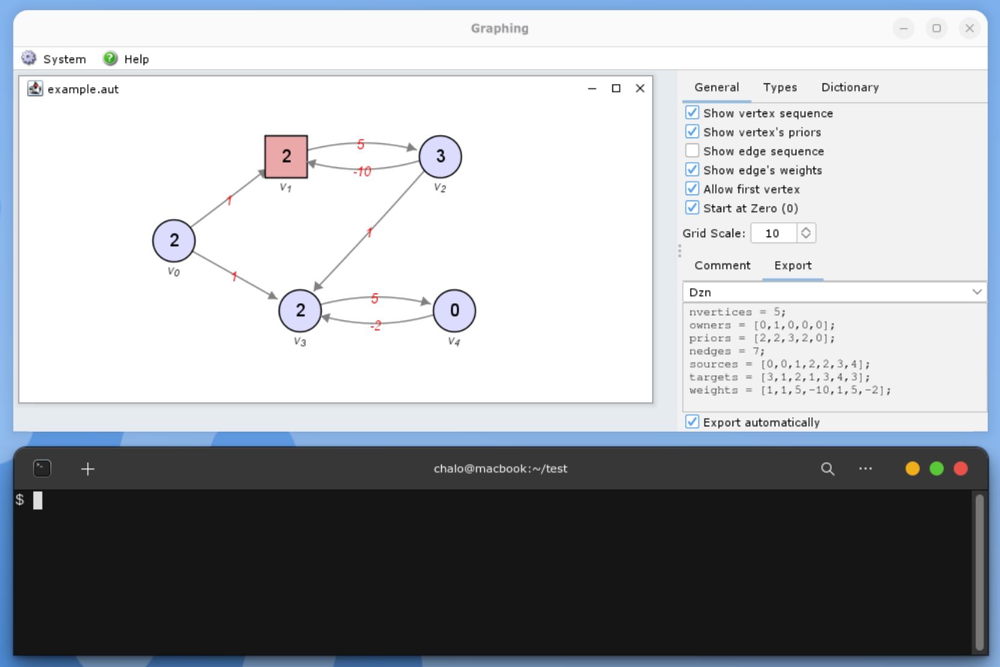

# NOCQ: A Constraint-Based Toolchain for Parity Games with Quantitative Conditions

NOCQ is a high-performance C++ tool designed for solving parity games with quantitative conditions. It combines classic graph-based algorithms with modern **Constraint Programming (CP)** and **SAT** techniques. By default, models are solved using the *Chuffed* solver, with *Gecode* and *CaDiCaL* also integrated as optional backends.

## Project Structure

* `src/main.cpp`:   Main entry point and CLI logic.
* `src/cp_nocq/`:   CP Models and Propagators
* `src/utils/`:     Core implementations and additional algorithms
* `thirdparty/`:    External dependencies (includes a local copy of the Chuffed solver).
* `resources/`:     Script for solving in parallel from EVEN and ODD perspective.
* `examples/`:      DZN and GMW files as examples. 
                    Includes AUD files to edit arenas 
                    [github.com/gonzalohernandez/graphing](https://github.com/GonzaloHernandez/graphing):

## Prerequisites

To build NOCQ, you need a Linux environment (tested on Arch Linux) with:
* **CMake** (v3.10 or higher)
* **GCC/G++** (v11 or higher, supporting C++17)
* **Bison** and **Flex** (required for building Chuffed)
* **Pthreads** library

## Installation & Building

**NOCQ** utilizes a CMake Superbuild system to automatically fetch and compile the Chuffed solver alongside the tool.

```bash
mkdir build
cd build
cmake .. [options]
cmake --build .
```

**Build options**

You can customize the build by passing variables to the cmake command using the -D flag:

- `ENABLE_GECODE`: Include support for the Gecode solver. Default=OFF
- `ENABLE_CADICAL`: Include support for the Cadical solver. Default=OFF
- `USE_SYSTEM_CHUFFED`: Use a system-installed version instead of the bundled version. Default=OFF
- `CMAKE_PREFIX_PATH=<directory>`: Specify custom directories for library searching (e.g., /opt).

### Docker (Cross-Platform)
To ensure all dependencies are correctly configured without modifying your host system, we provide a Dockerfile.  From the root directory of the project, run:

```bash
docker build -t nocq-docker .
```
For more information on containers, visit [Docker.com](https://www.docker.com/).

## Usage

Run NOCQ using the following syntax:

```bash
./nocq [options]
```
or
```bash
docker run --rm nocq-docker [options]
```

### Input & Game Generation

NOCQ can solve games from files or generate standard benchmarks on the fly:

**From File:**
* `--dzn <filename>`: Load a game from a MiniZinc data file (.dzn).
* `--gm <filename>`: Load a game from a PGSolver format file (.gm/.gmw).

**Benchmark Generators:**
* `--jurd <l> <b>`: Generate a Jurdzinski game with $l$ levels and $b$ blocks.
* `--rand <n> <p> <d1> <d2>`: Generate a random parity game with $n$ vertices, a maximum priority $p$, and outgoing degrees between $d_1$ and $d_2$.
* `--mladder <b>`: Generate a Modelchecker Ladder game with $b$ blocks.
* `--sprang <n> <d>`: Generate a random game with $n$ vertices and density $d$.
* `--sqnc <s> <t>`: Generate a 2-dimensional grids with wrap-around game with $s$ size and 5 types $t$ of transformations.

The benchmark generators included in this tool are based on established research in parity games and graph theory:

*   **Jurdzinski, Random, and Modelchecker Ladder:** These are implemented based on the **PGSolver** collection.
    *   *Reference:* Friedmann, O., & Lange, M. (2010). The PGSolver Collection of Parity Game Solvers. *Technical Report*, University of Munich.
*   **Sprang and Sqnc:** These generators are adapted from the experimental evaluation of shortest-path algorithms.
    *   *Reference:* Cherkassky, B. V., Goldberg, A. V., & Radzik, T. (1996). Shortest paths algorithms: Theory and experimental evaluation. *Mathematical Programming*, 73(2), 129–174.

### Global settings

**Parity condition reward:**
* `--max`: (Default). Winner is determined by the parity of the highest priority occurring infinitely often.
* `--min`: Winner is determined by the parity of the lowest priority occurring infinitely often.
<!-- * `--flip`: Priority Inversion. Maps each priority $p$ to $p+1$, effectively swapping the winning regions for Player 0 and Player 1. -->
**Additional info:**
* `--weights <w1> <w2>`: Define the range for edge weights from $w_1$ to $w_2$.

### Methods & Solving Engines

**Solvers:**
* `--noc-even` / `--noc-odd`: Solve for a specific player (EVEN or ODD) using the NOC approach.
* `--chuffed-bool`: Use the Chuffed CP solver using BoolVars (default).
* `--chuffed-int`: Use the Chuffed CP solver using IntVars.
* `--gecode`: Use the Gecode CP solver (if enabled).
* `--gecode`: Use the Cadical SAT solver (if enabled).

**Other algorithms:**

* `--fra`: algorithmse using the Fordward Recursive Algorithm.
* `--zra`: Solve using Zielonka's Recursive Algorithm.
* `--scc`: Decompose the game graph into Strongly Connected Components (SCCs) to optimize solving.

**Conditions:**
* `--parity`: Parity condition (default).
* `--energy <*threshold>`: Energy condition with optional <*> threshold by default 0.
* `--mean-payoff <*threshold>`: Mean-Payoff condition with optional <*> threshold by default 0.0.

### Output & Export

**Formatting:**
* `--verbose`: Print full execution details and progress.
* `--print-game`: Print the game graph structure.
* `--print-solution`: Print the winning regions and strategies for all vertices.
* `--print-statistics`: Print performance metrics after solving.

**Timing:**
* `--print-time`: Print result and the solving time.
* `--print-times`: Print result and all other timing data.
* `--print-only-time`: Print the solving time (no result).
* `--print-only-times`: Print all timing data (no result).

**Exporting:**
* `--export-dzn <filename>`: Save the current game in DZN format.
* `--export-gm <filename>`: Save the current game in GM format.
* `--export-gmw <filename>`: Save the game in GM format, including weight data.
* `--export-chpka <filename>`: Save the game in Energy format (Chaolupka).
* `--sat-encoding <filename>`: Encode the game into DIMACS format and save it to a file.

## Example

```bash
./nocq --rand 20 10 1 3 --weights -10 10 --noc --parity --mean-payoff --init 10
```

This execution generates a random game consisting of $n=20$ vertices with a maximum priority of $p=10$ and an out-degree for each vertex ranging between 1 and 3. It assigns random edge weights within the interval $[-10, 10]$ and utilizes the NOC (No-Opponent-Cycle) propagator to solve the game under both Parity and Mean-Payoff conditions simultaneously. The solver specifically computes the winning regions and strategies starting from the designated initial vertex 10.

## Parallel Solving

To exploit the problem duality of parity games, we provide a utility script that initiates parallel solving processes. The script runs the problem from the perspectives of both players simultaneously, terminating as soon as the first process finds a winning region.

From your build directory, you can run the parallel script on a generated random game:  

```bash
sh ../resources/nocq-parallel.sh --rand 1000 20 1 5 --noc --print-times
```

<!-- ## Tool Demonstration (NOCQ integration with external Graphing)

Integration with [Graphing](https://github.com/GonzaloHernandez/graphing) for visualization:

[](https://www.youtube.com/watch?v=7A_czF_oWW8)

*Click the image above to watch the demonstration.* -->